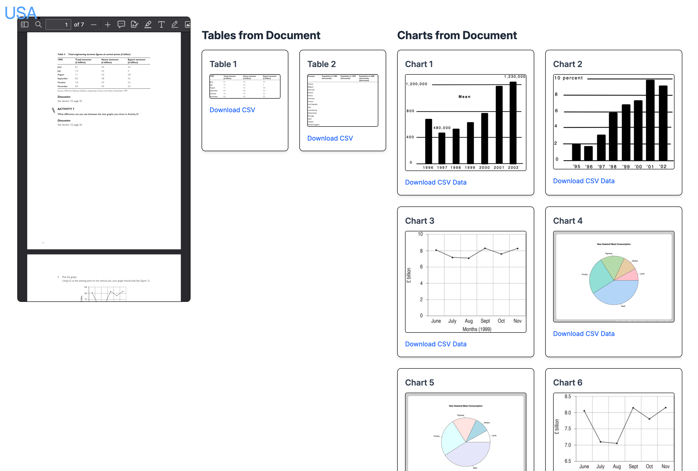
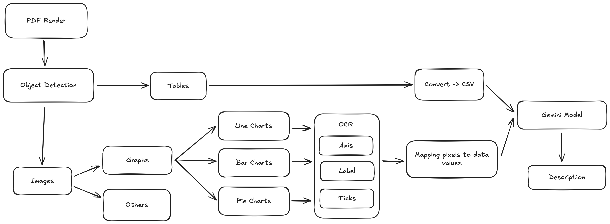

# USA.

> Understand, Summarize, Analyze




## Architecture



## Tech Stack
- Backend
  - Machine Learning - Docling, easyocr, google-gemini
  - Hosting - FastAPI
- Frontend
  - React Router v7

## Installation

### Requirements
- [Node.js 24.11.1](https://nodejs.org/en)
- [Python 3.12](https://www.python.org/downloads/) or [uv](https://docs.astral.sh/uv/getting-started/installation/)

### Steps
#### [Frontend](http://localhost:3000)
```sh
cd frontend
npm i
npm run dev
```

#### [Backend](http://localhost:8000/docs)
```sh
cd backend
uv sync
uv run fastapi dev ./fastapi.py --no-reload
```
